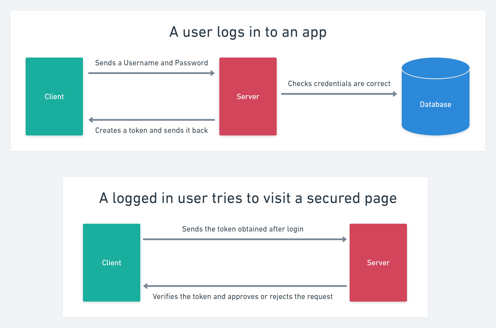

# JSON Web Tokens

## Learning Objectives

- Explain an authentication flow using bearer tokens
- Use a third-party library to create and verify JSON Web Tokens

## Introduction

There are various types of authentication systems; we'll be focusing on a common one referred to as *Bearer Authentication*. The core of the process works like this:
1. A user enters their login details into a form
2. The client sends the credentials to a server in the body of a request to an API
3. The server checks the credentials are correct
4. The server creates an access token for the user and sends it back to the client
5. The client saves the token and sends it in a request header when the user tries to access protected areas of the app

We can visualise the process like this:

